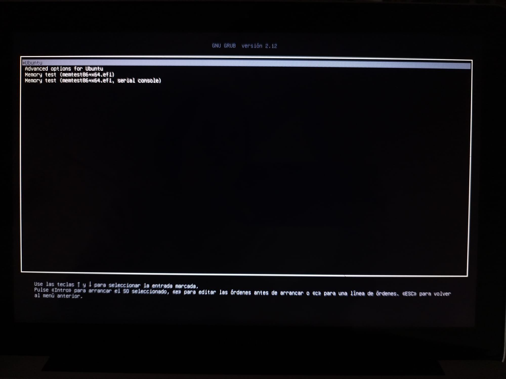
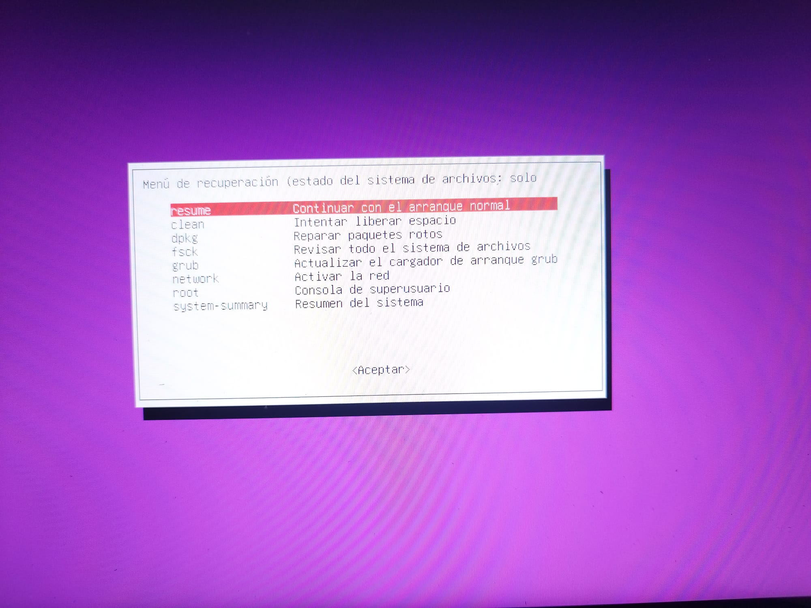
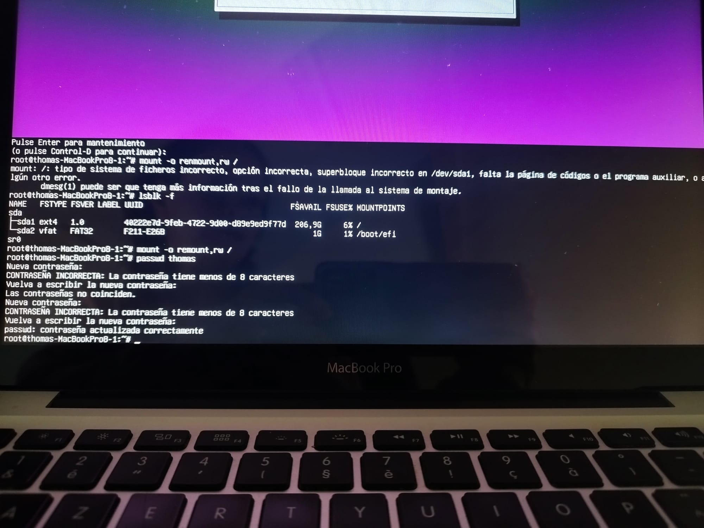

# 📊 Caso de Estudio / Case Study / Étude de Cas

Selecciona tu idioma / Select your language / Choisissez votre langue :

<details>
<summary><b>🇪🇸 Español (Haga clic para desplegar)</b></summary>

### 1. Resumen del Incidente
*   **Problema:** Pérdida total de acceso lógico por olvido de credenciales de usuario local en una estación de trabajo Ubuntu instalada de forma nativa en hardware Apple (Mac Legacy).
*   **Criticidad:** Alta (Sistema inoperable).
*   **Solución:** Evasión del entorno gráfico interactuando con el gestor de arranque (GRUB Console) para forzar la carga de la configuración del sistema e intervenir la cuenta mediante comandos directos.

---

### 2. Infraestructura del Laboratorio
*   **Hardware base:** Apple Mac (Legacy)
*   **Sistema Operativo Objetivo:** Ubuntu Linux (Nativo)
*   **Vector de Intervención:** Acceso físico local (Physical Access).

---

### 3. Análisis de Ejecución y Evidencias Visuales

#### Fase 1: Diagnóstico e Interrupción del Bootloader
Durante el ciclo de encendido, se interrumpió el proceso de arranque automático para invocar la interfaz de comandos del cargador de arranque **GRUB** (`grub_es>`). 

Utilizando el comando `ls`, se realizó un mapeo de las particiones físicas del disco duro para identificar el volumen donde reside el sistema operativo, detectando la estructura en la partición `(hd1,gpt2)`.

<p align="center"></p>

#### Fase 2: Forzado de Configuración y Carga del Núcleo
Debido a las restricciones del mapeo de teclado del hardware Apple bajo Linux, se procedió a evadir la consola de comandos inyectando la ruta directa del archivo de configuración principal de arranque mediante el comando:

```bash
configfile (hd1,gpt2)/boot/grub/grub.cfg
```

Este comando forzó al hardware a ejecutar los archivos de configuración originales, reiniciando el entorno de manera segura y desplegando la inicialización del sistema operativo de forma exitosa.

<p align="center"></p>
<p align="center"></p>

---

### 4. Conclusión de Ciberseguridad (Hallazgos)
Este ejercicio práctico demuestra de forma empírica el principio fundamental de la seguridad física: **"Si un atacante tiene acceso físico sin restricciones a tu hardware, los controles de seguridad lógicos tradicionales (como las contraseñas visuales) quedan anulados"**. 

A través de la consola de arranque, un analista puede auditar las tripas de un sistema operativo e intervenirlo en minutos si el disco no se encuentra debidamente protegido.

### 5. Mitigación Recomendada para Entornos Reales
Para evitar que un tercero use este mismo método para acceder a los datos de la empresa, las contramedidas recomendadas son:
1.  **Cifrado de Disco Completo (LUKS):** Asegura que los datos sean ilegibles aunque se consiga arrancar el sistema por la fuerza.
2.  **Contraseña en el GRUB:** Bloquear con contraseña la consola de comandos de arranque para que nadie sin autorización pueda teclear directivas en la pantalla negra.

</details>

<details>
<summary><b>🇺🇸 English (Click to expand)</b></summary>

### 1. Incident Summary
*   **Issue:** Total loss of logical access due to forgotten local user credentials on an Ubuntu workstation natively installed on Apple hardware (Mac Legacy).
*   **Severity:** High (System inoperable).
*   **Resolution:** Bypassing the graphical environment by interacting with the bootloader (GRUB Console) to force load the system configuration and modify the account using direct commands.

---

### 2. Lab Infrastructure
*   **Base Hardware:** Apple Mac (Legacy)
*   **Target OS:** Ubuntu Linux (Native)
*   **Intervention Vector:** Local Physical Access.

---

### 3. Execution Analysis & Visual Evidence

#### Phase 1: Diagnosis and Bootloader Interruption
During the power cycle, the automatic boot process was interrupted to invoke the **GRUB** bootloader command-line interface (`grub_es>`). 

Using the `ls` command, a mapping of the physical hard drive partitions was performed to identify the volume hosting the operating system, detecting the structure within the `(hd1,gpt2)` partition.

*(Upload Photo 1 here: )*

#### Phase 2: Configuration Forcing and Kernel Loading
Due to Apple hardware keyboard mapping restrictions under Linux, the command console was bypassed by injecting the direct path to the main boot configuration file using the following command:

```bash
configfile (hd1,gpt2)/boot/grub/grub.cfg
```

This command forced the hardware to execute the original configuration files, restarting the environment securely and successfully deploying the operating system initialization.

*(Upload Photo 2 here: )*

---

### 4. Cybersecurity Conclusion (Findings)
This practical exercise empirically demonstrates the core principle of physical security: **"If an attacker has unrestricted physical access to your hardware, traditional logical security controls (such as visual passwords) are rendered null."** 

Through the boot console, an analyst can audit the inner workings of an operating system and compromise it within minutes if the disk is not properly secured.

### 5. Recommended Mitigation for Real Environments
To prevent third parties from using this same method to access corporate data, the recommended countermeasures are:
1.  **Full Disk Encryption (LUKS):** Ensures data remains unreadable even if root console access is achieved by force.
2.  **GRUB Password Protection:** Lock the boot command console with a password so unauthorized personnel cannot execute directives on the black screen.

</details>

<details>
<summary><b>🇫🇷 Français (Cliquez para dérouler)</b></summary>

### 1. Résumé de l'Incident
*   **Problème :** Perte totale d'accès logique suite à l'oubli des identifiants d'un utilisateur local sur une station de travail Ubuntu installée nativement sur du matériel Apple (Mac Legacy).
*   **Criticité :** Haute (Système inopérant).
*   **Solution :** Contournement de l'environnement graphique en interagissant avec le chargeur d'amorçage (Console GRUB) pour forcer le chargement de la configuration du système et intervenir sur le compte via des commandes directes.

---

### 2. Infrastructure du Laboratoire
*   **Matériel de base :** Apple Mac (Legacy)
*   **Système d'Exploitation Cible :** Ubuntu Linux (Natif)
*   **Vecteur d'Intervention :** Accès physique local (Physical Access).

---

### 3. Analyse de l'Exécution et Preuves Visuelles

#### Phase 1 : Diagnostic et Interruption du Bootloader
Pendant le cycle de démarrage, le processus d'amorçage automatique a été interrompu pour invoquer l'interface de commande du chargeur d'amorçage **GRUB** (`grub_es>`). 

À l'aide de la commande `ls`, un mappage des partitions physiques du disque dur a été effectué afin d'identifier le volume où réside le système d'exploitation, détectant la structure sur la partition `(hd1,gpt2)`.

*(Téléchargez la Photo 1 ici : )*

#### Phase 2 : Forçage de la Configuration et Chargement du Noyau
En raison des restrictions de mappage du clavier du matériel Apple sous Linux, la console de commande a été contournée en injectant le chemin direct du fichier de configuration principal d'amorçage via la commande :

```bash
configfile (hd1,gpt2)/boot/grub/grub.cfg
```

Cette commande a forcé le matériel à exécuter los fichiers de configuration d'origine, redémarrant l'environnement de manière sécurisée et déployant avec succès l'initialisation du système d'exploitation.

*(Téléchargez la Photo 2 ici : )*

---

### 4. Conclusion en Cybersécurité (Constats)
Cet exercice pratique démontre de manière empirique le principe fondamental de la sécurité physique : **"Si un attaquant dispose d'un accès physique sans restriction à votre matériel, les contrôles de sécurité logique traditionnels (tels que los mots de passe visuels) sont annulés."** 

Via la console d'amorçage, un analyste peut auditer los entrailles d'un système d'exploitation et y intervenir en quelques minutes si le disque n'est pas correctement protégé.

### 5. Atténuation Recommandée pour los Environnements Réels
Pour éviter qu'un tiers n'utilise cette même méthode pour accéder aux données de l'entreprise, los contre-mesures recommandées sont :
1.  **Chiffrement Intégral du Disque (LUKS) :** Assure que les données restent lisibles même si l'accès à la console Root est obtenu par la force.
2.  **Mot de passe sur le GRUB :** Verrouiller la console de commande d'amorçage avec un mot de passe pour que personne non autorisé ne puisse saisir de directives sur l'écran noir.

</details>
